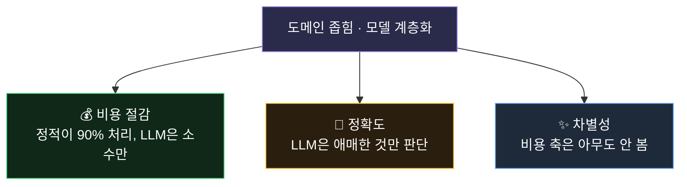
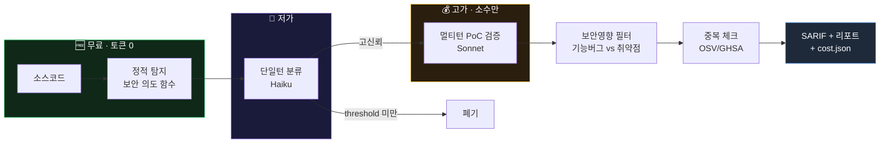

<div align="center">

# 🛡️ ETK-Scanner

### Cost-Aware Security Scanner
#### 비용을 1급 지표로 삼은 LLM 보안 스캐너

*정적 분석으로 넓게 훑고, 저렴한 LLM으로 걸러, 비싼 검증은 소수에만.
예산 상한 안에서 취약점을 찾고 · 수정하고 · 실제로 막혔는지 실증한다.*


-8A2BE2)


[개요](#-개요) · [철학](#-설계-철학) · [아키텍처](#-아키텍처) · [기술스택](#-기술-스택) · [설치](#-설치) · [사용법](#-사용법) · [실증](#-실증-결과) · [비용](#-비용-인식)

</div>

---

## 📌 개요

**ETK-Scanner**는 LLM으로 소스코드 취약점을 찾되, **비용을 설계의 중심에 둔** 보안 스캐너다.

기존 LLM 스캐너는 정확도만 최적화한다. 매 함수를 비싼 모델에 멀티턴으로
밀어넣어 패키지 하나에 수천 원이 든다. 개인·학생이 CI에 매 커밋 돌리기 어렵다.

이 프로젝트는 **정적 분석이 90%를 무료로 처리하고, LLM은 걸러진 소수에만**
쓰는 계층 캐스케이드로 그 비용을 무너뜨린다. 그리고 탐지에서 멈추지 않고
**발견 → 수정 → 실제 exploit 실증**까지 하나의 사이클로 잇는다.

### 한눈에

| | |
|---|---|
| 🆓 **무료 정적 티어** | LLM 0 토큰, 매 PR에 부담 없음 |
| 💸 **모델 계층화** | 싼 모델로 분류 → 비싼 검증은 걸러진 소수에만 |
| 📊 **예산 가드레일** | 상한 초과 전 자동 중단, 모든 단계 비용 기록 |
| 🔁 **탐지→수정→실증** | exploit before/after를 실제 HTTP로 증명 |
| 🌐 **다언어** | Python(AST) + JavaScript/TypeScript(정규식) |
| 🔌 **CI 네이티브** | SARIF 2.1.0 → GitHub Security 탭, exit-code 게이트 |

> 📉 **자체 측정: 멀티턴 방식 대비 비용 6.7배 절감** (동일 대상 5,000원 → 750원)

---

## 🧭 설계 철학

### 핵심 통찰

> **"LLM에게 발굴을 시키지 마라. 결정론적 도구로 후보를 좁히고,
> LLM은 좁은 판단만 시켜라. 그리고 실제 실행으로 검증하라."**

성공한 보안 도구들의 공통 공식을 조사해 도출한 원칙이다. 이 하나가 세 문제를
동시에 푼다:



### 3대 원칙

| 원칙 | 구현 |
|------|------|
| **결정론은 코드로** | AST/정규식 탐지 = 토큰 0 |
| **LLM은 계층화** | 저가 분류 → 고가 검증(소수) |
| **증명은 실행으로** | PoC 실제 실행, 비용은 로그로 |

### "싱크"가 아니라 "보안 의도"를 본다

전통 스캐너는 위험 함수(`eval`, `exec`)만 본다. 하지만 **권한 우회·검증 우회
같은 로직 버그는 싱크가 없다.** 그래서 "보안 판단을 하는 함수"(validate/check/
auth/verify…) 자체를 후보로 삼는다. 이것이 싱크 기반이 놓치는 취약점을 잡는 열쇠.

---

## 🏗 아키텍처



### 단계별 상세

| # | 단계 | 모듈 | 비용 | 하는 일 |
|:-:|------|------|:----:|---------|
| 0 | 지도 | `graph_builder.py` | 0 | 콜그래프 구축 (보조) |
| 1 | **탐지** | `intent_finder*.py` | 0 | 보안 판단 함수 추출 — high recall |
| 2 | **분류** | `screen_single.py` | 저 | 단일턴 가설 + 신뢰도 점수 |
| 3 | **검증** | `agent.py` | 고(소수) | 멀티턴 탐색 + 실제 PoC 실행 |
| 4 | **필터** | `security_filter.py` | 저 | 기능버그 vs 보안취약점 |
| 5 | **중복** | `dup_check.py` | 저 | OSV/GHSA 기지 여부 조회 |
| — | 회계 | `provider.py` | — | 모든 호출 비용 기록 + 예산 상한 |

각 단계가 후보를 좁혀, 비싼 LLM은 극소수에만 도달한다.

---

## 🧰 기술 스택

| 영역 | 기술 |
|------|------|
| 파이프라인 | **Python 3.12** — AST 분석, 오케스트레이션 |
| LLM | **Claude** (Haiku 분류 / Sonnet 검증) — 계층화 |
| 정적 분석 | Python `ast`, 다언어 정규식 (JS/TS/Py) |
| 비용 회계 | 자체 `provider.py` — 토큰/비용 누적 + 예산 가드레일 |
| 출력 | **SARIF 2.1.0** — GitHub Security 탭 연동 |
| CI | **GitHub Actions** — exit-code 게이트 |
| 실증 | **Node.js** + Docker — 재현 환경 |
| 취약점 DB | **OSV.dev** API — 중복 체크 |

---

## ⚙️ 설치

### 실행 전제 — Claude Code

이 프로젝트는 **[Claude Code](https://claude.com/claude-code)** 환경에서
개발·구동된다. LLM 단계는 Anthropic API를 호출하며 `ANTHROPIC_API_KEY`가 필요하다.
(정적 티어는 키 없이 무료로 동작.)

```bash
# 1. 의존성
pip install anthropic pyyaml

# 2. API 키 (LLM 티어 사용 시에만)
cp .env.example .env
#    .env 에 ANTHROPIC_API_KEY 입력

# 3. 예산 설정 (선택)
#    config/budget.yaml — total_budget_krw, 모델 가격, 단계별 상한
```

---

## 🚀 사용법

### 🆓 무료 정적 스캔 (LLM 0, CI 기본값)

```bash
python scripts/scan.py <repo> --mode static --fail-on high
```
```console
[ETK-Scan] ./target | mode=static
[결과] 4건 | {'high': 2, 'medium': 1, 'low': 1} | 비용 0원 | 0.3초
[출력] SARIF=results.sarif cost=cost.json
[게이트] high 이상 발견 → CI 실패
```
→ `results.sarif` (GitHub Security 탭) + `cost.json` 생성. **비용 0원.**

### 💸 LLM 티어 (예산 상한)

```bash
python scripts/scan.py <repo> --mode llm --package <name> --budget 1000
```
```console
[3/4 분류] 단일턴 가설 생성 (Haiku, 도구 없음)
  분류 통과 (>= 0.5): 19/30
  [OK] 예산 내 94원 / 2000원 | 호출 30회
```
단일턴 분류가 정적 후보를 정제. `--budget`(원) 초과 예상 시 자동 중단.

### 🔬 전체 파이프라인 (발굴 → 검증 → 필터 → 리포트)

```bash
python scripts/agent_runner.py <ID> <package> --repo <path> --max-seeds 30
```
```console
의도함수 30 → 분류통과 19 → 검증 4 → 확정버그 3 → 보안취약점 1
비용 750원 | 리포트 1건 생성
```

### 🔌 CI (GitHub Action)

`.github/workflows/security-scan.yml`:
- **PR / push** → 무료 정적 티어, SARIF 업로드, job summary에 비용 리포트
- **수동 실행** → LLM 티어 옵션 (예산 입력)
- **high+ 발견 시 게이트 실패** → 취약 PR 자동 차단

---

## 🔬 실증 결과

실제 개인 프로젝트(**TypeScript/Express 백엔드**)를 감사해 인증 취약점을
발견 → 수정 → **실제 HTTP 서버로 exploit before/after 실증**했다.

### 1️⃣ 정적 스캐너가 자동 탐지 (LLM 0)

```console
[9.0] secretKey      (login.controller.ts)   hardcoded_secret   ← CWE-798
[9.0] secretKey      (verify.token.ts)        hardcoded_secret
[5.5] authMiddleware                           jwt.verify sink
[3.5] token_log                                CWE-532
```
공개 저장소에 JWT 시크릿 `'my-secret-key'`가 박혀 있음 → **누구나 토큰 위조 가능.**

### 2️⃣ 진단 (CIA)

| 축 | 침해 | 근거 |
|----|:----:|------|
| 기밀성 | ✅ | 위조 토큰으로 타인 데이터 열람 |
| 무결성 | ✅ | article 수정/삭제 |
| 가용성 | ❌ | 서비스 중단과 무관 |

→ **권한 탈취 (auth bypass), CWE-798 → CWE-287**

### 3️⃣ Exploit 실증 (실제 HTTP)

```console
# 취약본
$ curl -H "x-auth-token: <위조>" localhost:10000/article
  토큰 없이:  HTTP 401
  위조 토큰:  HTTP 200  {"msg":"보호 데이터","user":{"userId":"attacker"}}   ← 침입

# 수정본 (env 시크릿)
$ curl -H "x-auth-token: <유출 시크릿 위조>" localhost:10000/article
  위조 토큰:  HTTP 401  {"msg":"토큰 무효"}                                  ← 차단
```

| 요청 | 취약본 | 수정본 |
|------|:------:|:------:|
| 토큰 없음 | 401 | 401 |
| 유출 시크릿으로 위조 | **200 침입** | **401 차단** |

> 실제 `jsonwebtoken` 라이브러리 + 실제 HTTP 서버 대상. 추정 아님.

### 4️⃣ CI 게이트

```console
[취약본]  4건 | high 2 | 0원  →  게이트 실패 (PR 차단)
[수정본]  1건 | high 0 | 0원  →  게이트 통과
```

📄 **상세 실증 보고서 → [docs/PORTFOLIO.md](docs/PORTFOLIO.md)**

---

## 💰 비용 인식

모든 실행은 `cost.json`에 단계별 비용을 기록한다 — "비용 인식" 주장의 검증 가능한 증거.

```json
{ "mode": "llm", "findings": 3, "cost_krw": 750, "cost_per_finding_krw": 250 }
```

### 실측 비용

| 대상 | 모드 | 토큰 | 비용 |
|------|:----:|:----:|:----:|
| TypeScript 백엔드 | static | 0 | **0원** |
| Python 패키지 (소형) | llm | 1,887 | **5원** |
| Python 패키지 (중형) | full | ~15K | **750원** |

### 왜 싼가

- 정적 티어가 넓은 스캔을 **토큰 0**으로 처리
- LLM은 걸러진 후보에만 (30개 중 4개 검증)
- 단일턴 우선, 멀티턴은 극소수

### 비용 진화 (자체 측정)

| 방식 | 동일 대상 비용 | 개선 |
|------|:----:|:----:|
| 멀티턴 에이전트 (초기 설계) | 5,000원+ | — |
| **계층 캐스케이드 (현재)** | **750원** | **6.7×** |

---

## 📂 프로젝트 구조

```
scripts/
  scan.py                  # CI 진입점 (static|llm), SARIF + 비용 + exit 게이트
  agent_runner.py          # 전체 파이프라인 오케스트레이터
  bench.py                 # 비용 벤치마크
  pipeline/
    intent_finder.py       # 정적: 보안 의도 함수 (Python AST)
    intent_finder_multi.py # 정적: 다언어 (JS/TS 정규식)
    screen_single.py       # 단일턴 분류 (저가 모델)
    agent.py               # 멀티턴 PoC 검증 (고가 모델)
    security_filter.py     # 기능버그 vs 보안취약점
    dup_check.py           # OSV/GHSA 중복 체크
    provider.py            # API + 비용 회계 + 예산 가드레일
    sarif.py               # SARIF 2.1.0 출력
    report_gen.py          # 증명 리포트 (PoC 재실행 박제)
config/
  budget.yaml              # 예산 상한 · 모델 가격 · 단계별 상한
  gates.yaml · sinks.yaml  # 정적 룰셋
.github/workflows/security-scan.yml
docs/
  PORTFOLIO.md             # 상세 포트폴리오 (실증 전과정)
  architecture.md          # 아키텍처 설계
  devlog.md                # 개발 로그 (시행착오 포함)
```

---

## 🗺 차후 개발 방향

**단기**
- OSV/GHSA 중복 체크를 실제 스캔 흐름에 붙여, 이미 알려진 취약점을 신고 전에 자동 제외
- Docker 격리 환경에서 e2e exploit 검증을 CI 단계로 자동화
- 비용 벤치마크를 여러 대상에 돌려 단계별 토큰/비용 수치를 표로 공개

**중기**
- 정적 탐지의 다언어 커버리지 확대 (Go, Java) — 현재 Python/JS·TS
- tree-sitter 도입으로 정규식 기반 JS/TS 탐지의 오탐 축소
- 과거 CVE 패치 diff를 분류 단계의 few-shot 예시로 활용해 정확도 보강

**장기**
- 라이브러리 취약점과 그 라이브러리를 쓰는 실제 코드베이스를 연결해
  "누구 책임인가 / 실제 악용 지점이 있는가"까지 추적
- 조직 단위 피드백 메모리 — 과거 오탐/판정을 누적해 반복 오탐 억제

---

## 범위

비용 효율과 엔지니어링에 초점을 둔 프로젝트다. 신규 CVE 자동 발굴을 보장하지
않는다. 핵심은 예산 통제형 파이프라인과 발견→수정→실증 사이클이며, 정확도
경쟁이 아니라 비용 축에서 차별화한다.
