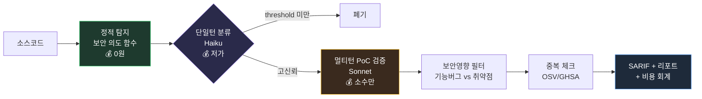

<div align="center">

# 🛡️ ETK-Scanner

### Cost-Aware Security Scanner — 비용을 1급 지표로 삼은 LLM 보안 스캐너

*정적 분석으로 넓게 훑고, 저렴한 LLM으로 걸러, 비싼 검증은 소수에만.
예산 상한 안에서 취약점을 찾고 · 수정하고 · 실제로 막혔는지 실증한다.*


-8A2BE2)


</div>

---

## 왜 만들었나 (Motivation)

LLM 기반 보안 스캐너는 대부분 **정확도**만 본다. 그래서 비싸다 — 매 함수를
비싼 모델에 멀티턴으로 밀어넣으면 패키지 하나에 수천 원이 든다. 학생이나
개인이 CI에 매 커밋 돌리기엔 부담스럽다.

**ETK-Scanner는 반대로 설계됐다: 비용이 설계의 중심.**

- 🆓 **무료 정적 티어** — LLM 0, 매 PR에 부담 없음
- 💸 **저가 → 고가 계층화** — 싼 모델로 분류, 비싼 검증은 걸러진 소수에만
- 📊 **예산 가드레일** — 상한 초과 전 자동 중단, 모든 단계 비용 기록
- 🔁 **발견 → 수정 → 실증** — 탐지에서 끝나지 않고 exploit before/after까지

> 자체 측정: 멀티턴 에이전트 방식 대비 **비용 6.7배 절감** (동일 대상 5,000원 → 750원).

---

## 아키텍처 (Architecture)



**설계 철학 — "LLM에게 발굴을 시키지 마라, 좁은 판단만 시켜라":**

| 단계 | 담당 | 비용 | 역할 |
|------|------|------|------|
| 탐지 | 정적 분석 (AST/정규식) | 0 | high recall, 넓게 |
| 분류 | 저가 LLM 단일턴 | 저 | 후보 압축 |
| 검증 | 고가 LLM 멀티턴 + PoC | 고 (소수) | precision, 실증 |
| 필터 | LLM 단일턴 | 저 | 기능버그 제거 |

결정론적으로 할 수 있는 건 코드로(토큰 0), LLM은 의미 판단에만.

---

## 기술 스택 (Tech Stack)

| 영역 | 기술 |
|------|------|
| 파이프라인 | Python 3.12 (AST 분석, 오케스트레이션) |
| LLM | Claude (Haiku 분류 / Sonnet 검증) — 계층화 |
| 정적 분석 | Python `ast`, 다언어 정규식 (JS/TS/Py) |
| 비용 회계 | 자체 `provider.py` (토큰/비용 누적 + 예산 상한) |
| 출력 | SARIF 2.1.0 (GitHub Security 탭 연동) |
| CI | GitHub Actions |
| 실증 | Node.js + Docker (재현 환경) |
| 취약점 DB | OSV.dev API (중복 체크) |

---

## 실행 전제 — Claude Code

이 프로젝트는 **[Claude Code](https://claude.com/claude-code)** 환경에서 개발·구동된다.
파이프라인의 LLM 단계는 Anthropic API를 호출하며, `ANTHROPIC_API_KEY`가 필요하다.

---

## 설정 (Setup)

```bash
# 1. 의존성
pip install anthropic pyyaml

# 2. API 키 (LLM 티어 사용 시)
cp .env.example .env
# .env 에 ANTHROPIC_API_KEY 입력

# 3. 예산 설정 (선택)
# config/budget.yaml — total_budget_krw, 모델 가격, 단계별 상한
```

---

## 사용법 (Usage)

### 🆓 무료 정적 스캔 (LLM 0, CI 기본)
```bash
python scripts/scan.py <repo> --mode static --fail-on high
# → results.sarif (GitHub Security 탭) + cost.json
```

### 💸 LLM 티어 (예산 상한)
```bash
python scripts/scan.py <repo> --mode llm --package <name> --budget 1000
```

### 🔬 전체 파이프라인 (발굴 → 검증 → 필터 → 리포트)
```bash
python scripts/agent_runner.py <ID> <package> --repo <path> --max-seeds 30
```

### CI (GitHub Action)
`.github/workflows/security-scan.yml` — PR마다 무료 정적 스캔, SARIF 업로드,
high+ 발견 시 게이트 실패.

---

## 검증 결과 (Verified Results)

실제 개인 프로젝트(TypeScript/Express 백엔드)를 감사해 인증 취약점을 발견,
수정하고, **실제 HTTP 서버로 exploit before/after를 실증**했다.

| 요청 | 취약본 | 수정본 |
|------|--------|--------|
| 토큰 없음 | 401 | 401 |
| 유출 시크릿으로 위조 | **200 (침입 성공)** | **401 (차단)** |

정적 스캐너가 하드코딩 시크릿(CWE-798)을 최고점으로 자동 탐지 → CI 게이트가
취약 PR 차단 → 수정 후 통과.

📄 **상세 실증 보고서 → [docs/PORTFOLIO.md](docs/PORTFOLIO.md)**

---

## 비용 (Cost)

모든 실행은 `cost.json`에 단계별 비용을 기록한다 — "비용 인식" 주장의 증거.

```json
{ "mode": "llm", "findings": 3, "cost_krw": 750, "cost_per_finding_krw": 250 }
```

| 대상 | 모드 | 토큰 | 비용 |
|------|------|------|------|
| TypeScript 백엔드 | static | 0 | **0원** |
| Python 패키지 (소형) | llm | 1,887 | **5원** |
| Python 패키지 (중형) | full | ~15K | **750원** |

---

## 프로젝트 구조

```
scripts/
  scan.py              # CI 진입점 (static | llm), SARIF + 비용 + exit 게이트
  agent_runner.py      # 전체 파이프라인 오케스트레이터
  bench.py             # 비용 벤치마크
  pipeline/
    intent_finder.py       # 정적: 보안 의도 함수 (Python AST)
    intent_finder_multi.py # 정적: 다언어 (JS/TS 정규식)
    screen_single.py       # 단일턴 분류 (저가)
    security_filter.py     # 기능버그 vs 취약점
    dup_check.py           # OSV/GHSA 중복 체크
    provider.py            # API + 비용 회계 + 예산 가드레일
    sarif.py               # SARIF 2.1.0 출력
.github/workflows/security-scan.yml
docs/architecture.md · docs/PORTFOLIO.md · docs/devlog.md
```

---

<div align="center">

**설계 원칙:** 코드로 될 건 코드로(토큰 0), LLM은 판단만.
**증명 원칙:** 추정 금지 — 비용은 로그로, 취약점은 실제 실행으로.

</div>
