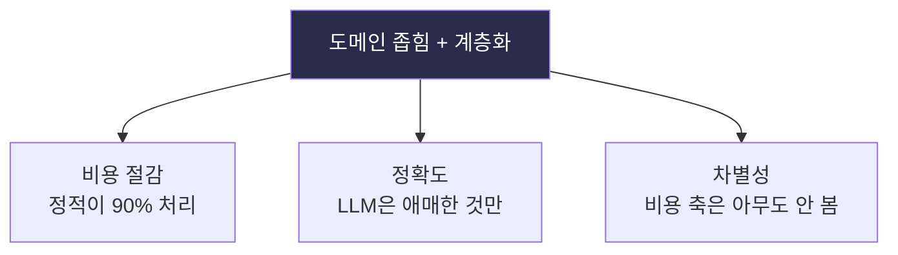

<div align="center">

# 🛡️ ETK-Scanner — 포트폴리오

### 비용 인식 LLM 보안 스캐너: 설계 · 구동 · 실증

*발견에서 끝나지 않는다. 수정하고, 실제 서버에서 막혔는지 증명한다.*

</div>

---

## 목차

1. [한눈에 보기](#1-한눈에-보기)
2. [문제 정의 & 설계 철학](#2-문제-정의--설계-철학)
3. [아키텍처](#3-아키텍처)
4. [핵심 방법론](#4-핵심-방법론)
5. [비용 최적화 — 정량 증거](#5-비용-최적화--정량-증거)
6. [실증 사례: 인증 취약점 발견 → 수정 → 검증](#6-실증-사례)
7. [구동 방법](#7-구동-방법)
8. [기술적 의사결정 기록](#8-기술적-의사결정-기록)
9. [역량 요약](#9-역량-요약)

---

## 1. 한눈에 보기

| 항목 | 내용 |
|------|------|
| **한 줄 소개** | 예산 상한 안에서 취약점을 찾고·수정하고·실증하는 LLM 보안 스캐너 |
| **차별점** | 비용을 1급 지표로 — 정적 무료 티어 + 저가/고가 모델 계층화 + 비용 회계 |
| **개발 환경** | Claude Code (Anthropic API) |
| **실증** | 실제 TS/Express 백엔드 감사 → 하드코딩 시크릿 발견 → HTTP exploit before/after |
| **비용 성과** | 멀티턴 방식 대비 **6.7× 절감** (5,000원 → 750원, 동일 대상 자체 측정) |

---

## 2. 문제 정의 & 설계 철학

### 문제
LLM 보안 스캐너는 정확도만 최적화한다. 매 함수를 비싼 모델에 멀티턴으로
넣으면 패키지 하나에 수천 원. 개인이 CI에 매 커밋 돌리기 어렵다.

### 핵심 통찰
> **"LLM에게 발굴을 시키지 마라. 결정론적 도구로 후보를 좁히고,
> LLM은 좁은 판단만 시켜라. 그리고 실제 실행으로 검증하라."**

이 원칙이 세 가지를 동시에 푼다:



### 3대 설계 원칙

| 원칙 | 구현 |
|------|------|
| **결정론은 코드로** | AST/정규식 탐지 = 토큰 0 |
| **LLM은 계층화** | 저가 분류 → 고가 검증 (소수만) |
| **증명은 실행으로** | PoC 실제 실행, 비용은 로그로 |

---

## 3. 아키텍처

```mermaid
flowchart LR
    subgraph FREE["🆓 무료 (토큰 0)"]
        A[소스코드] --> B[정적 탐지<br/>보안 의도 함수]
    end
    subgraph CHEAP["💸 저가"]
        B --> C[단일턴 분류<br/>Haiku]
    end
    subgraph EXP["💰 고가 · 소수만"]
        C -->|고신뢰| D[멀티턴 PoC 검증<br/>Sonnet]
    end
    D --> E[보안영향 필터]
    E --> F[중복 체크<br/>OSV/GHSA]
    F --> G[SARIF + 리포트<br/>+ cost.json]
    C -->|threshold 미만| X[폐기]

    style FREE fill:#0f2818,stroke:#4ade80
    style CHEAP fill:#1a1a3a,stroke:#a78bfa
    style EXP fill:#2a1e0f,stroke:#fbbf24
```



### 각 단계 역할

| # | 단계 | 모듈 | 비용 | 하는 일 |
|---|------|------|------|---------|
| 0 | 지도 | `graph_builder.py` | 0 | 콜그래프 (보조) |
| 1 | 탐지 | `intent_finder*.py` | 0 | 보안 판단 함수 추출 (high recall) |
| 2 | 분류 | `screen_single.py` | 저 | 단일턴 가설 + 신뢰도 |
| 3 | 검증 | `agent.py` | 고(소수) | 멀티턴 탐색 + 실제 PoC 실행 |
| 4 | 필터 | `security_filter.py` | 저 | 기능버그 vs 보안취약점 |
| 5 | 중복 | `dup_check.py` | 저 | OSV/GHSA 기지 여부 |
| — | 회계 | `provider.py` | — | 모든 호출 비용 기록 + 예산 상한 |

---

## 4. 핵심 방법론

### 4.1 "보안 의도 함수" 탐지 (싱크가 아니라 의도)

전통적 스캐너는 위험 함수(`eval`, `exec`)만 본다. 하지만 **로직 버그
(권한 우회, 검증 우회)는 싱크가 없다.** 그래서 "보안 판단을 하는 함수"
자체를 후보로 삼는다.

```
탐지 신호: 이름(validate/check/auth/verify...) + bool 반환 +
          외부 입력 파라미터 + 손으로 짠 파싱(startswith/regex)
```

### 4.2 기능버그 vs 보안취약점 분리

핵심 질문: **"공격자가 무엇을 얻는가(attacker gain)?"**

| 발견 | 진짜 버그? | 보안 취약점? |
|------|-----------|-------------|
| 체크섬 미검증 | ✅ | ❌ (공격자 이득 없음) |
| 하드코딩 시크릿 | ✅ | ✅ (토큰 위조 → 계정 탈취) |

이 필터가 "재현됨 ≠ 신고 가능"을 자동 구분한다.

### 4.3 취약점 진단 기준 (CIA)

| 축 | 침해 시 |
|----|---------|
| 기밀성 (C) | 비밀/남 데이터 노출 |
| 무결성 (I) | 무단 변조 |
| 가용성 (A) | 서비스 붕괴 (DoS류) |

---

## 5. 비용 최적화 — 정량 증거

### 진화: 멀티턴 → 계층 캐스케이드

| 방식 | 대상 | 비용 | 결과 |
|------|------|------|------|
| 멀티턴 에이전트 (초기) | 중형 패키지 | 5,000원+ | 불안정 |
| **계층 캐스케이드 (현재)** | 동일 대상 | **750원** | 안정 |

→ **6.7배 절감**, 동일 대상 자체 측정.

### 단계별 비용 (cost.json)

```
의도함수 30개 (정적)  →  0원
  ↓ 단일턴 분류        →  ~100원
검증 4개 (멀티턴)      →  ~600원
  ↓ 보안필터
확정 = 750원 총
```

### 왜 싼가
- 정적 티어가 넓은 스캔을 토큰 0으로 처리
- LLM은 걸러진 후보에만 (30개 중 4개 검증)
- 단일턴 우선, 멀티턴은 극소수

---

## 6. 실증 사례

**대상:** 개인 TypeScript/Express 백엔드 (JWT 인증)

### 6.1 발견 — 하드코딩 JWT 시크릿

정적 스캐너가 자동 탐지 (LLM 0):
```
[9.0] secretKey   (login.controller.ts)   hardcoded_secret  ← CWE-798
[9.0] secretKey   (verify.token.ts)        hardcoded_secret
[5.5] authMiddleware                        jwt.verify sink
[3.5] token_log                             CWE-532
```
공개 저장소에 시크릿 `'my-secret-key'`가 박혀 있음 → **누구나 토큰 위조 가능.**

### 6.2 진단

| CIA | 침해 | 근거 |
|-----|------|------|
| 기밀성 | ✅ | 위조 토큰으로 타인 데이터 열람 |
| 무결성 | ✅ | article 수정/삭제 |
| 가용성 | ❌ | 서비스 중단 무관 |

→ **권한 탈취 (auth bypass), CWE-798 → CWE-287**

### 6.3 Exploit 실증 (실제 HTTP 서버)

authMiddleware 격리 실행 → 위조 토큰으로 보호 라우트 `/article` 요청.

**취약본:**
```console
$ BRANCH=vuln node e2e_server.js
$ curl -H "x-auth-token: <my-secret-key로 위조>" localhost:10000/article

토큰 없이:  HTTP 401
위조 토큰:  HTTP 200  {"msg":"보호 데이터","user":{"userId":"attacker"}}
```
→ **자격증명 0으로 침입 성공.**

**수정본:**
```console
$ BRANCH=fixed JWT_SECRET=<env> node e2e_server.js
$ curl -H "x-auth-token: <유출 시크릿으로 위조>" localhost:10000/article

위조 토큰:  HTTP 401  {"msg":"토큰 무효"}
```
→ **유출 시크릿 무효화, 침입 차단.**

| 요청 | 취약본 | 수정본 |
|------|:------:|:------:|
| 토큰 없음 | 401 | 401 |
| 위조 토큰 | **200 침입** | **401 차단** |

> 실제 `jsonwebtoken` 라이브러리 + 실제 HTTP 서버. 추정 아님.

### 6.4 수정 (커밋 diff)

```diff
- const secretKey = 'my-secret-key';
+ const secretKey = process.env.JWT_SECRET;
+ if (!secretKey) throw new Error('JWT_SECRET environment variable is not set');
```
```diff
  const existUser = await User.findOne({
-   where: { id, password },   // 평문 password 쿼리 제거 (bcrypt.compare가 인증)
+   where: { id },
  });
```
+ 토큰 로깅 제거(CWE-532), `.env.example` 추가.

### 6.5 CI 게이트

```console
[취약본]  4건 | high 2 | 0원  →  게이트 실패 (PR 차단)
[수정본]  1건 | high 0 | 0원  →  게이트 통과
```
정적 스캐너 → SARIF → GitHub Security 탭 → high+ 시 PR 차단.

---

## 7. 구동 방법

### 전제: Claude Code + ANTHROPIC_API_KEY

```bash
pip install anthropic pyyaml
cp .env.example .env    # ANTHROPIC_API_KEY 입력
```

### 무료 정적 스캔
```bash
python scripts/scan.py <repo> --mode static --fail-on high
```

### 전체 파이프라인
```bash
python scripts/agent_runner.py <ID> <package> --repo <path>
```

### 실증 재현 (Docker)
```bash
cd candidates/wiki-backend
docker compose -f docker/docker-compose.yml up --build -d
bash verify_e2e.sh    # 취약:200 / 수정:401
```

---

## 8. 기술적 의사결정 기록

정직한 시행착오도 기록 — 엔지니어링 판단력의 증거.

| 문제 | 판단 | 근거 |
|------|------|------|
| 멀티턴 비용 폭증 | 단일턴 캐스케이드로 전환 | 6.7× 절감 측정 |
| 싱크 기반이 로직버그 놓침 | "보안 의도 함수" 탐지로 전환 | validators SSRF 발견 |
| "재현됨"을 취약점으로 오판 | 보안영향 필터 추가 | 기능버그(checksum) 자동 제외 |
| 기지 취약점 신고 위험 | OSV 중복 체크 추가 | 신고 전 자동 조회 |
| 실증 중 포트 잔존 오판 | 즉시 정정 후 재검증 | 200→401 정직 재측정 |

전체 개발 로그: [devlog.md](devlog.md)

---

## 9. 역량 요약

| 영역 | 증명 |
|------|------|
| **보안 분석** | JWT/인증 흐름 분석, CWE 분류, CIA 판정 |
| **Exploit 실증** | 실제 라이브러리·HTTP 서버 before/after |
| **AI 파이프라인** | 계층화 LLM, 예산 가드레일, 비용 회계 설계 |
| **DevSecOps** | 정적 스캐너 + SARIF + CI 게이트 + Docker |
| **비용 엔지니어링** | 6.7× 절감 정량 달성 |
| **정직성** | 시행착오·오판 기록 및 정정 |

---

<div align="center">

**코드로 될 건 코드로. LLM은 판단만. 증명은 실행으로.**

</div>
